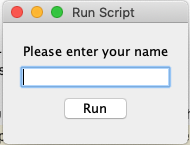
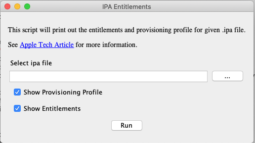

# Shellmarks
Simple GUI Wrappers for Shell Scripts

## Synopsis

Shellmarks is a shell script wrapper that allows you to set environment variables via a GUI form prior to the script's execution.

The GUI form is defined using [TOML](https://toml.io/en/) inside the shell script.  If the shell script is run using `shellmarks`, it will first check for such a form definition in the script, and display it to the user.  The user then fills in the form, and presses "Run".  It then runs the script using the script's desired interpreter (as specified by its `#!`) with the user's input in the script's environment.

## Hello World

The following is a simple script that prints _hello ${name}_, where _${name}_ is provided by the user.

```bash
#!/bin/bash
echo "Hello ${name}"
exit 0
<shellmarks>
[name]
  type="text"
  label="Please enter your name"
  required=true
</shellmarks>
```

If you run this script using _bash_ directly, it will simply output:

~~~
Hello
~~~

This is because the _${name}_ environment variable is not set.

If you, instead, run this with `shellmarks`, it will prompt the user to enter their name in a GUI dialog:



If the user enters "Steve" into the text field, and presses "Run", they'll see the following output in the console.

~~~
Hello Steve
~~~

## More Advanced Example

The following script is a more advanced example that involves a few more field types.  The script is one that I wrote to extract the entitlements and provisioning profile information from an IPA file.  I use this script quite frequently to help support users of [Codename One](https://www.codenameone.com) when they run into issues relating to entitlements and certificates on their iOS apps.

```bash
#!/bin/bash
file_extracted="${file}-extracted"
if [ ! -d "${file_extracted}" ]; then
    if [ ! -f "$file" ]; then
        echo "Cannot find file $file"
        exit 1
    fi
    mkdir "${file_extracted}"
    cp "$file" "${file_extracted}/App.zip"
    cd "${file_extracted}"
    unzip App.zip
else
    cd ${file_extracted}
fi
appname=$(ls Payload | grep '\.app$')
if [ ! -z "$showEntitlements" ]; then
    codesign -d --entitlements :- "Payload/${appname}"
fi
if [ ! -z "$showProvisioningProfile" ]; then
    security cms -D -i "Payload/${appname}/embedded.mobileprovision"
fi
exit 0
<shellmarks>
title="IPA Entitlements"
description='''
<asciidoc>
This script will print out the entitlements and provisioning profile for given .ipa file.

See https://developer.apple.com/library/archive/qa/qa1798/_index.html[Apple Tech Article] for more information.
</asciidoc>
'''
[file]
    type="file"
    label="Select ipa file"
    required=true
    help="Select the .ipa file that you wish to inspect."

[showEntitlements]
    type="checkbox"
    label="Show Entitlements"
    default="true"
    help="Check this to show the ipa entitlements."

[showProvisioningProfile]
    type="checkbox"
    label="Show Provisioning Profile"
    default="true"
    help="Check this to show the ipa provisioning profile details."

</shellmarks>

```

If this script is in a file named _ipa-tools.sh_, then you can run it via:

~~~
shellmarks ipa-tools.sh
~~~

The GUI dialog looks like:



## Script Structure

Shell scripts written for _shellmarks_ are just regular shell scripts.  At the end of the script you simply add a section with:

~~~
exit 0
<shellmarks>
... Your GUI definitions here in TOML format
</shellmarks>
~~~

Some notes:

We add `exit 0` so that the script exits before reaching the `<shellmarks>` definition.  This ensures that the script will remain compatible with the default shell iterpreter (e.g. bash).

The `<shellmarks></shellmarks>` signal _shellmarks_ that there is metadata here for it to process.

The contents of this tag will be interpreted as [TOML](https://toml.io/en/).

## Installation

Installation requires that you have NodeJS installed, because the installer uses npm.

[Download NodeJS here](https://nodejs.org/en/download/)

Then, open a terminal, and enter:

```bash
sudo npm install -g shellmarks
```

NOTE: On windows you may not require the "sudo" part.  Just `npm install -g shellmarks`

On Mac and Linux the `sudo` is required to give npm access to install it globally.

## Requirements

Shellmarks should run on any modern Windows, Linux, or Mac system.

## Documentation

- Getting Started Guide
- Command-line Options
- GUI Form Options
- Sample Scripts


