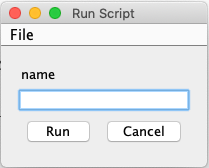
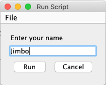
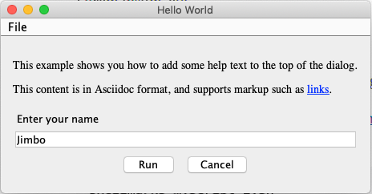
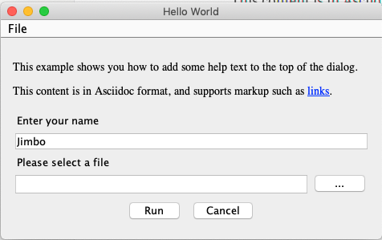
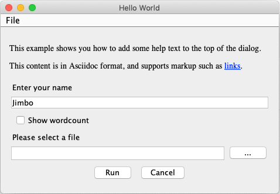

= Shellmarks User Guide
:doctype: book
:toc:

> A documentation and GUI generator for your custom shell scripts.

= Introduction

[discrete]
== The Problem

Over the years, as a software developer, I've amassed a shed-load of shell scripts for automating various frequently-used (or _potentially_ frequently-used) tasks. While these scripts have undeniably helped my productivity, their full utility remains unrealized due to two thorny impediments:

1. *I forget where I _put_ the scripts*.  Sometimes I create a script to help with a particular project, so I save it in a location that is associated with that project.  Later on, I face a similar problem on a different project, and I recall that I wrote a script that may apply here, but I don't remember exactly where I saved the script, or what it was called.  I may not even remember which computer I saved it on.  What is the MacBook, or the iMac.  I don't recall.  So I'll just write the same thing again from scratch.
2. *I forget how to _use_ the scripts.*  What flags do I need to set?  Does the script expect any environment variables to be set?  Before using an old script, I need to read through the full script again to _download_ it into my brain and determine its applicability to the current situation.

[discrete]
== The Vision
Every once in a while I think, wouldn't it be nice to have a single, well-structured webpage that included documentation for all of the tasks that I may need to perform on a daily basis?  Something like a personal _O'Reilly_ book with chapters for all of the projects, clients, and topics that relate to my work.

Further, wouldn't it be nice if my shell scripts included a graphical user interface for setting the required flags and environment variables?  If, for example, the script is designed to perform some task on a particular directory or file, the GUI would include a file dialog for selecting this file.

[discrete]
== The Solution: Shellmarks

Shellmarks is the embodiment of this vision.  It includes two parts:

1. *It provides a GUI markup language* (using TOML syntax) that can be embedded directly into a shell script. When the script is run using shellmarks, it will display a dialog to the user, prompting them to provide some environment variables.  Currently the dialog can contain text fields, file selection fields, and checkbox fields, but more field types can easily be added as needs be.
2. *It provides a searchable catalog of all of your installed scripts*.  The catalog includes documentation for each script, as well as buttons to _Run_, _Edit_, _Clone_, and _Delete_ them.

= Getting Started

== Installation

NOTE: We use https://www.npmjs.com/[npm] for installation because it is cross-platform and easy to use.  _npm_ comes with NodeJS, which can be downloaded from https://nodejs.org/en/download/[here].

[source,bash]
----
sudo npm install -g shellmarks
----

TIP: _sudo_ is required here on Mac and Linux, because we want to install it globally.  That is what the `-g` flag is for.  `sudo` is not required on Windows.

== Your First Script

For our first script, let's write a simple "Hello World" script:

[source,bash]
----
#!/bin/bash <1>
echo "Hello ${name}" <2>
exit 0 <3>
---<4>
[name] <5>
----
<1> Hash-bang is required so that shellmarks knows which shell interpreter to run the script through after it displays the UI dialog.
<2> We echo `"Hello ${name}"` where `${name}` is an environment variable that we supply in the UI dialog.
<3> We need to explicitly exit the script before the Shellmarks UI markup begins.
<4> The `---` divider, on a line of its own, tell _shellmarks_ where the UI markup begins.  Everything after this line will be interpreted as the UI markup, and must be valid TOML.
<5> We declare a "name" field in the UI dialog for setting the `${name}` environment variable.

Save this script in a file named "hello.sh", then run it from the command-line with:

[source,bash]
----
shellmarks hello.sh
----

This will prompt you with the following dialog:

Enter "Duke" into the _name_ text field, and press "Run".  You should then see the following in the console:

[source,listing]
----
Hello Duke
----

=== Customizing the Name Field

The above example is a bare minimal example that displays a single text field.   You can customize the field label using the _label_ property.  You can also make the field required using the _required_ property.  And you can set a default value using the _default_ property.  For example:

[source,bash]
----
#!/bin/bash
echo "Hello ${name}"
exit 0
---
[name]
  label="Enter your name"
  help="This will be displayed in a tooltip"
  required=true
  default="Jimbo"
----

=== Customizing Dialog Title and Help Text

You can customize the the dialog title using the _\__title___ property.  You can also provide some text to be displayed at the top of the form using the _\__description___ property, as follows:

[source,bash]
----
#!/bin/bash
echo "Hello ${name}"
exit 0
---
__title__="Hello World"
__description__='''
This example shows you how to add some help text to the top of the dialog.

This content is in Asciidoc format, and supports markup such as https://www.example.com[links].
'''

[name]
  label="Enter your name"
  help="This will be displayed in a tooltip"
  required=true
  default="Jimbo"
----

=== File Selection

It is quite common to take a file or directory as input in a shell script.  For example, let's add some output in our script that displays the word count for a file.  We can use the `type="file"` in the field description to allow the user to select a file or directory.

[source,bash]
----
#!/bin/bash
echo "Hello ${name}"
wordcount=$(wc "${file}")
echo "Word count in ${file} is ${wordcount}"
exit 0
---
__title__="Hello World"
__description__='''
This example shows you how to add some help text to the top of the dialog.

This content is in Asciidoc format, and supports markup such as https://www.example.com[links].
'''

[name]
  label="Enter your name"
  help="This will be displayed in a tooltip"
  required=true
  default="Jimbo"

[file]
  type="file"
  label="Please select a file"
  help="The word count for the selected file will be output"
  required=true
----

Notice here that the _file_ field includes a text field and a "..." button.  In the text field you could simply type or paste teh path to a file.  Pressing the "..." button will show a file dialog where you can select a file.

=== Checkboxes

In some cases, you may want the user to select between two different options: "on" or "off".  You can use the _checkbox_ field type to handle this.  For example, Let's make the _wordcount_ feature of our script optional, so that it is only shown when the user checks the "Show wordcount" option.

E.g.

[source,bash]
----
#!/bin/bash
echo "Hello ${name}"
if [ ! -z "$showWordcount" ]; then <1>
    wordcount=$(wc "${file}")
    echo "Word count in ${file} is ${wordcount}"
fi
exit 0
---
__title__="Hello World"
__description__='''
This example shows you how to add some help text to the top of the dialog.

This content is in Asciidoc format, and supports markup such as https://www.example.com[links].
'''

[name]
  label="Enter your name"
  help="This will be displayed in a tooltip"
  required=true
  default="Jimbo"

[showWordcount]
  label="Show wordcount"
  help="Check this box to display the wordcount of a file."
  type="checkbox" <2>

[file]
  type="file"
  label="Please select a file"
  help="The word count for the selected file will be output"
----
<1> We use `if [ ! -z "$showWordcount" ]` to check if the `$showWordcount` environment variable is not empty, and only do the _wordcount_ stuff in that case.
<2> We set `type="checkbox"` for the `showWordcount` field so that it is rendered with a checkbox.

== The Shellmarks Catalog

We've already seen how shellmarks can provide a GUI for individual shell scripts.  It gets better, though.  If you run `shellmarks` without any arguments, it will open a catalog of all of your installed scripts, including documentation, and the ability to run your scripts by pressing a "Run" button.

