= Shellmarks User Guide
Steve Hannah <steve@weblite.ca>
v1.0.0, 2021-12-20
:description: This document contains usage instructions for the Shellmarks application.
:doctype: book
:toc:
:sectnums:
:icons: font

> A documentation and GUI generator for your custom shell scripts.

[introduction]
= Introduction

[discrete]
== The Problem

Over the years, as a software developer, I've amassed a shed-load of shell scripts for automating various frequently-used (or _potentially_ frequently-used) tasks. While these scripts have undeniably helped my productivity, their full utility remains unrealized due to two thorny impediments:

1. *I forget where I _put_ the scripts*.  Sometimes I create a script to help with a particular project, so I save it in a location that is associated with that project.  Later on, I face a similar problem on a different project, and I recall that I wrote a script that may apply here, but I don't remember exactly where I saved the script, or what it was called.  I may not even remember which computer I saved it on.  What is the MacBook, or the iMac.  I don't recall.  So I'll just write the same thing again from scratch.
2. *I forget how to _use_ the scripts.*  What flags do I need to set?  Does the script expect any environment variables to be set?  Before using an old script, I need to read through the full script again to _download_ it into my brain and determine its applicability to the current situation.

[discrete]
== The Vision
Every once in a while I think, wouldn't it be nice to have a single, well-structured webpage that included documentation for all of the tasks that I may need to perform on a daily basis?  Something like a personal _O'Reilly_ book with chapters for all of the projects, clients, and topics that relate to my work.

Further, wouldn't it be nice if my shell scripts included a graphical user interface for setting the required flags and environment variables?  If, for example, the script is designed to perform some task on a particular directory or file, the GUI would include a file dialog for selecting this file.

[discrete]
== The Solution: Shellmarks

Shellmarks is the embodiment of this vision.  It includes two parts:

1. *A GUI markup language* (using https://toml.io/en/[TOML syntax]) that can be embedded directly into a shell script. When the script is run using shellmarks, it will display a dialog to the user, prompting them to provide some environment variables.  Currently the dialog can contain text fields, file selection fields, buttons, and checkbox fields, but more field types can easily be added as needs be.
2. *A searchable catalog of all of your installed scripts*.  The catalog includes documentation for each script, as well as buttons to _Run_, _Edit_, _Clone_, and _Delete_ them.

[getting-started]
= Getting Started

== Installation

NOTE: We use https://www.npmjs.com/[npm] for installation because it is cross-platform and easy to use.  _npm_ comes with NodeJS, which can be downloaded from https://nodejs.org/en/download/[here].

[source,bash]
----
sudo npm install -g shellmarks
----

TIP: _sudo_ is required here on Mac and Linux, because we want to install it globally.  That is what the `-g` flag is for.  `sudo` is not required on Windows.

== Your First Script

For our first script, let's write a simple "Hello World" script:

[source,bash]
----
#!/bin/bash <1>
echo "Hello ${name}" <2>
exit 0 <3>
---<4>
[name] <5>
----
<1> Hash-bang is required so that shellmarks knows which shell interpreter to run the script through after it displays the UI dialog.
<2> We echo `"Hello ${name}"` where `${name}` is an environment variable that we supply in the UI dialog.
<3> We need to explicitly exit the script before the Shellmarks UI markup begins.
<4> The `---` divider, on a line of its own, tell _shellmarks_ where the UI markup begins.  Everything after this line will be interpreted as the UI markup, and must be valid https://toml.io/en/[TOML].
<5> We declare a "name" field in the UI dialog for setting the `${name}` environment variable.

Save this script in a file named "hello.sh", then run it from the command-line with:

[source,bash]
----
shellmarks hello.sh
----

This will prompt you with the following dialog:

image::images/hello-dialog.png[]

Enter "Duke" into the _name_ text field, and press "Run".  You should then see the following in the console:

[source,listing]
----
Hello Duke
----

=== Customizing the Name Field

The above example is a bare minimal example that displays a single text field.   You can customize the field label using the _label_ property.  You can also make the field required using the _required_ property.  And you can set a default value using the _default_ property.  For example:

[source,bash]
----
#!/bin/bash
echo "Hello ${name}"
exit 0
---
[name]
  label="Enter your name"
  help="This will be displayed in a tooltip"
  required=true
  default="Jimbo"
----

image::images/hello-dialog-2.png[]

=== Customizing Dialog Title and Help Text

You can customize the the dialog title using the _\__title___ property.  You can also provide some text to be displayed at the top of the form using the _\__description___ property, as follows:

[source,bash]
----
#!/bin/bash
echo "Hello ${name}"
exit 0
---
__title__="Hello World"
__description__='''
This example shows you how to add some help text to the top of the dialog.

This content is in Asciidoc format, and supports markup such as https://www.example.com[links].
'''

[name]
  label="Enter your name"
  help="This will be displayed in a tooltip"
  required=true
  default="Jimbo"
----

image::images/hello-dialog-3.png[]

=== File Selection

It is quite common to take a file or directory as input in a shell script.  For example, let's add some output in our script that displays the word count for a file.  We can use the `type="file"` in the field description to allow the user to select a file or directory.

[source,bash]
----
#!/bin/bash
echo "Hello ${name}"
wordcount=$(wc "${file}")
echo "Word count in ${file} is ${wordcount}"
exit 0
---
__title__="Hello World"
__description__='''
This example shows you how to add some help text to the top of the dialog.

This content is in Asciidoc format, and supports markup such as https://www.example.com[links].
'''

[name]
  label="Enter your name"
  help="This will be displayed in a tooltip"
  required=true
  default="Jimbo"

[file]
  type="file"
  label="Please select a file"
  help="The word count for the selected file will be output"
  required=true
----

image::images/hello-file-1.png[]

Notice here that the _file_ field includes a text field and a "..." button.  In the text field you could simply type or paste teh path to a file.  Pressing the "..." button will show a file dialog where you can select a file.

=== Checkboxes

In some cases, you may want the user to select between two different options: "on" or "off".  You can use the _checkbox_ field type to handle this.  For example, Let's make the _wordcount_ feature of our script optional, so that it is only shown when the user checks the "Show wordcount" option.

E.g.

[source,bash]
----
#!/bin/bash
echo "Hello ${name}"
if [ ! -z "$showWordcount" ]; then <1>
    wordcount=$(wc "${file}")
    echo "Word count in ${file} is ${wordcount}"
fi
exit 0
---
__title__="Hello World"
__description__='''
This example shows you how to add some help text to the top of the dialog.

This content is in Asciidoc format, and supports markup such as https://www.example.com[links].
'''

[name]
  label="Enter your name"
  help="This will be displayed in a tooltip"
  required=true
  default="Jimbo"

[showWordcount]
  label="Show wordcount"
  help="Check this box to display the wordcount of a file."
  type="checkbox" <2>

[file]
  type="file"
  label="Please select a file"
  help="The word count for the selected file will be output"
----
<1> We use `if [ ! -z "$showWordcount" ]` to check if the `$showWordcount` environment variable is not empty, and only do the _wordcount_ stuff in that case.
<2> We set `type="checkbox"` for the `showWordcount` field so that it is rendered with a checkbox.

image::images/hello-checkbox-1.png[]

=== Buttons

The "button" type provides an alternate way to pass boolean values to your script.  If you define any fields with the "button" type, they will be rendered on your script's dialog instead of the standard "Run" button.  Pressing the button will run the script, but with the corresponding environment variable set to "1".

.Example: A dialog with 3 buttons.
[source,bash]
----
#!/bin/bash

if [ ! -z "$button1Clicked" ]; then
    echo "Button 1 was clicked"
fi
if [ ! -z "$button2Clicked" ]; then
    echo "Button 2 was clicked"
fi
if [ ! -z "$button3Clicked" ]; then
    echo "Button 3 was clicked"
fi
exit 0
---
# The script title
__title__="Buttons Sample"

# Script description in Asciidoc format
__description__='''
This example shows how to use the 'button' field type to add multiple submit buttons on your dialog.
'''

# Tags used to place script into one or more sections of the catalog
__tags__="#samples"

[button1Clicked]
    label="Button 1"
    type="button"

[button2Clicked]
    label="Button 2"
    type="button"

[button3Clicked]
    label="Button 3"
    type="button"

----

The dialog for this script is:

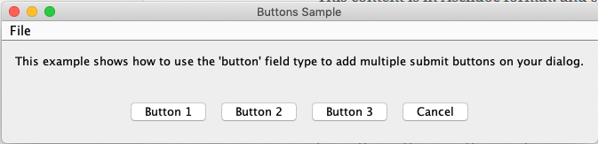

If you click on "Button 1", it will set the `${button1Clicked}` environment variable, so the script can detect this case.  Similarly the other buttons will set their corresponding environment variable when they are pressed.

==== Dispose On Submit

The default behaviour of shellmarks is to dispose the dialog when the user submits the form by either pressing the "Run" button or a button defined by a field with `type="button"`.  In some cases, you may want to keep the dialog open so that you can run the script again with different settings.  For example a server management script might include buttons to _Start_, _Stop_, and _Check Status_ on the server.  In this case you may want to run _Check Status_ first to see if the server is running, and then press _Start_ to start the server.  It would be annoying if the dialog closed after checking the status.

You can use the _disposeOnSubmit_ property to control this:

e.g.

[source,bash]
----
[startServer]
  type="button"
  label="Start Server"
  disposeOnSubmit=false

[stopServer]
  type="button"
  label="Stop Server"
  disposeOnSubmit=false

[serverStatus]
  type="button"
  label="Check Server Status"
  disposeOnSubmit=false
----

== The Shellmarks Catalog

We've already seen how shellmarks can provide a GUI for individual shell scripts.  It gets better, though.  If you run `shellmarks` without any arguments, it will open a catalog of all of your installed scripts, including documentation, and the ability to run your scripts by pressing a "Run" button.

.Open the Shellmarks catalog by simply running _shellmarks_ with no arguments.
[source,bash]
----
shellmarks
----

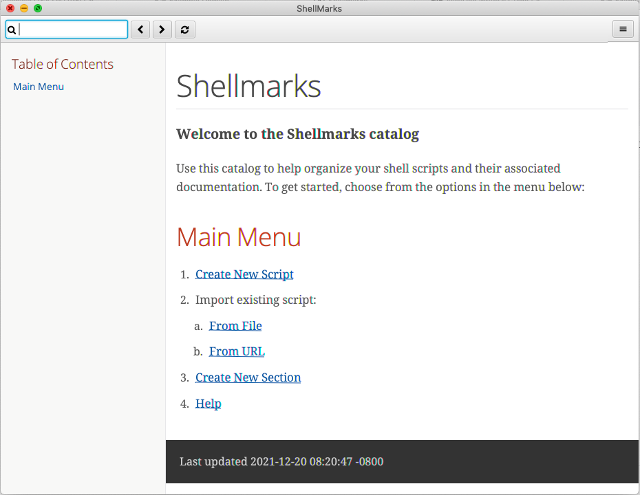

The first time you open the catalog, it won't have any scripts listed.  You can add scripts to your catalog by either creating a new script, or by importing an existing one.  To create a new script, click the "Create New Script" link in the main menu.  To import an existing script, you can press "From File", or "From URL" depending on whether you are loading it from a local file or from a network URL.

Let's start by creating a new script.  Click "Create New Script".

You'll be prompted to enter a name for the script:

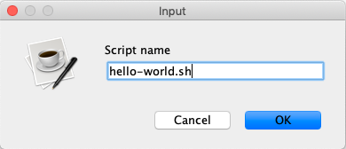

Enter "hello-world.sh" for the name, and press "OK".

If all goes well, it should open the script for editing in your default text editor.  To help you get started, the script will be pre-populated with a default shell script.  This template may change over time, but at the time of writing, the default script contents are:

[source,bash]
----
#!/bin/bash
echo "Hello ${firstName} ${lastName}"
echo "You selected ${selectedFile}"
if [ ! -z "${option1}" ]; then
  echo "Option1 was selected"
fi
if [ ! -z "${option2}" ]; then
  echo "Option2 was selected"
fi
exit 0
---
# The script title
__title__="hello-world.sh"

# Script description in Asciidoc format
__description__='''
This description will be displayed at the top of the form.

It can be multiline and include https://example.com[Links]
'''

# Doc string.  In asciidoc format.  Displayed in Shellmarks catalog
__doc__='''
This will be displayed in the shellmarks catalog.

You can include _asciidoc_ markup, as well as https://www.example.com[links].
'''

# Tags used to place script into one or more sections of the catalog
__tags__="#custom-tag1 #custom-tag2"

[firstName]
  label="First Name"
  required=true

[lastName]
  label="Last Name"

[selectedFile]
  label="Please select a file"
  type="file"

[option1]
  label="Option 1"
  type="checkbox"

[option2]
  label="Option 2"
  type="checkbox"

----

It is just a simple script that prompts the user for their first and last name, and it prints "Hello FIRSTNAME LASTNAME" to the console.  If you go back into the Shellmarks catalog, you should see your script listed now.

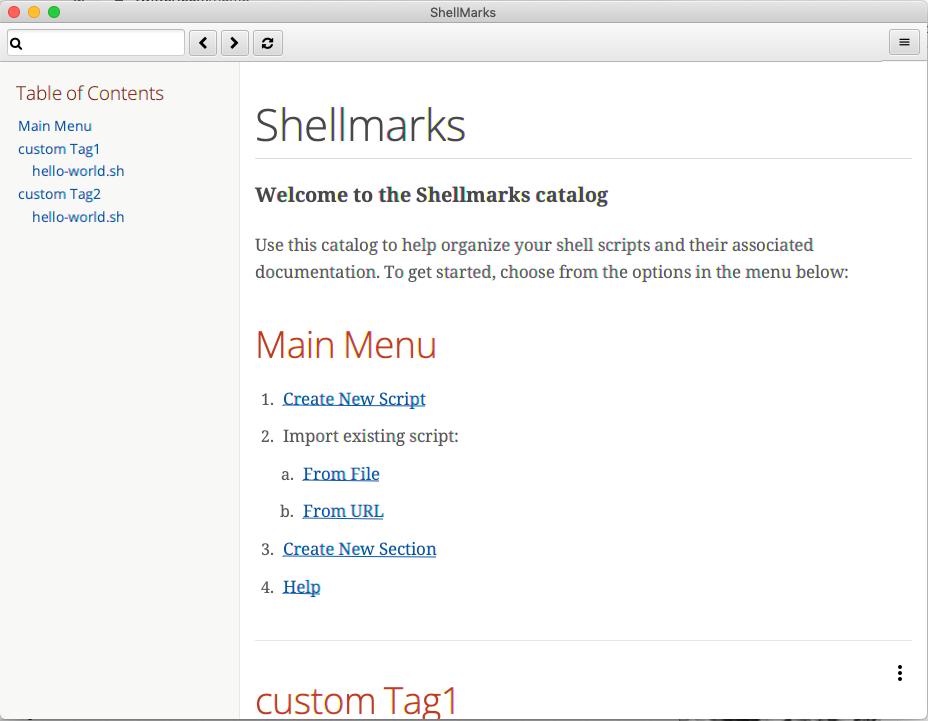

In the _Table of Contents_, you should see two instances of the _hello-world.sh_ script you just created.  One under "custom Tag 1", and the other under "custom Tag2".  This is because the script includes a `__tags__` property with two tags: "#custom-tag1 #custom-tag2".  Tags allow you to categorize your scripts into sections.  We'll discuss those in more depth later.

Either scroll down to the "hello-world.sh" script, or click one of the links to it in the table of contents.  You should see an entry as follows:

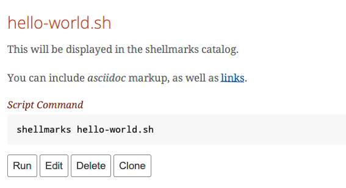

All of this information is pulled directly from the properties in the _hello-world.sh_.  Script.  It includes a description that is taken from the `\\__doc__` property.  It shows the script _command_ which can be pasted into the terminal to run the script directly.  And it provides four buttons:

Run::
Runs the script directly.
Edit::
Opens the script to be edited in the system text editor.
Delete::
Delete's the script
Clone::
Makes a clone of the script.

Press "Run" to run the script.  It should open the script's dialog as shown here:

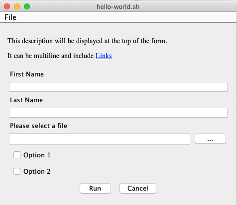

If you enter data into the form fields and press "Run", you'll see the script output in the console.

TIP: The script output will appear in the terminal window that you used to launch shellmarks originally.

=== Creating a "Samples" category

Currently, our script is filed under two categories "custom Tag1", and "custom Tag2".  Let's move it to a new category called "Samples".

Press the "Edit" button under the "hello-world.sh" script to open the script for editing.  Then changes the `\\__tags__` property to the following:

[source,bash]
----
__tags__="#samples"
----

Save these changes and return to the Shellmarks catalog and press the "Refresh" button in the upper left:

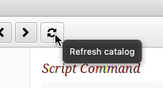

You should notice that the table of contents is changed.  Instead of "custom Tag1", and "custom Tag2", it has a "samples" option:

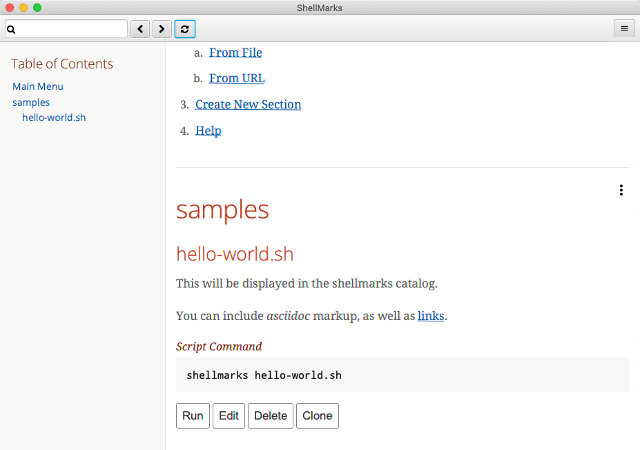

Now, let's customize the label for the "Samples" section add a description.  Notice to the right of the "samples" heading, there is a menu button.

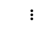

Press this button to expand the menu:

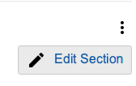

Now press the "Edit Section" menu item.

This will create an Asciidoc file with the section details in the system text editor.  If this is the first time you are editing the section, it will generate some default content:

[source,asciidoc]
----
= samples

This is the section description formatted as https://asciidoctor.org/docs/asciidoc-writers-guide/[Asciidoc]

Lorem ipsum, etc...
----

The first line will be used as the title of the section, and all of the content below it will be displayed in the catalog at the beginning of the section.  Let's change this to the following:

[source,asciidoc]
----
= Sample Scripts

This section includes a few sample scripts to demonstrate Shellmarks' syntax.
----

Save the changes and reload the Shellmarks catalog, and you should see the following:

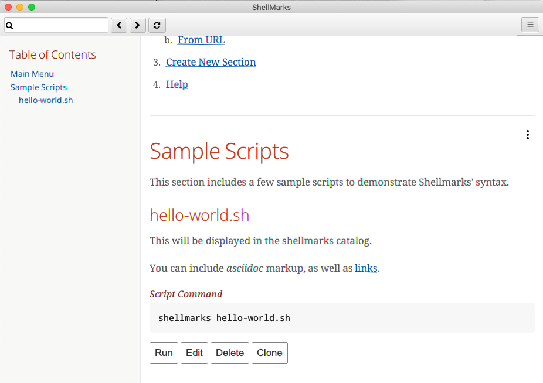

Notice that the section title is now "Sample Scripts", rather than "samples".  This is because we changed the heading in the section file.  Additionally, the section now includes a helpful description that was taken directly from our input.

TIP: You can include as much or as little content as you like in your section files. You can even create sub-headings.   All headings will be rendered with the appropriate heading level in the shellmarks catalog.

[faq]
= Frequently Asked Questions

== Script Syntax

=== What format is used for the Shellmark script GUI metadata?

Shellmark uses https://toml.io/en/[TOML] for all GUI metadata.

=== What scripting languages are supported by shellmarks?

You can use any scripting language you like for your shell scripts.  You just need to have the language installed on your computer, and the "hash-bang" line of your shell script should point to the interpreter.  E.g. If the script begins with: `#!/bin/bash`, it will use the bash shell interpreter.

For example, consider the following is the PHP equivalent of the default "Hello" script:

[source,php]
----
#!/usr/bin/php
<?php
$firstName = @$_ENV['firstName'];
$lastName = @$_ENV['lastName'];
$option1 = @$_ENV['option1'];
$option2 = @$_ENV['option2'];
$selectedFile = @$_ENV['selectedFile'];

echo "Hello ${firstName} ${lastName}";
echo "You selected ${selectedFile}";
if ($option1) {
    echo "Option1 was selected";
}
if ($option2) {
    echo "Option2 was selected";
}
exit(0);
?>
---
# The script title
__title__="hello-php.php"

# Script description in Asciidoc format
__description__='''
This description will be displayed at the top of the form.

It can be multiline and include https://example.com[Links]
'''

# Doc string.  In asciidoc format.  Displayed in Shellmarks catalog
__doc__='''
This will be displayed in the shellmarks catalog.

You can include _asciidoc_ markup, as well as https://www.example.com[links].
'''

# Tags used to place script into one or more sections of the catalog
__tags__="#custom-tag1 #custom-tag2"

[firstName]
  label="First Name"
  required=true

[lastName]
  label="Last Name"

[selectedFile]
  label="Please select a file"
  type="file"

[option1]
  label="Option 1"
  type="checkbox"

[option2]
  label="Option 2"
  type="checkbox"

----

== Shellmarks Catalog

=== Where are the scripts in the catalog stored?

Shellmarks stores all scripts in the `$HOME/.shellmarks/scripts` directory, where `$HOME` refers to the user's home directory.

This location can be overridden via the `SHELLMARKS_PATH` environment variable, whose default value is `$HOME/.shellmarks/scripts`.

=== Can I run multiple shellmarks instances with different catalogs?

Yes, by launching different instances of shellmarks with different values for the `SHELLMARKS_PATH` environment variable.

E.g.

[source, bash]
----
shellmarks #launch with default catalog

SHELLMARKS_PATH=/tmp/temp_catalog shellmarks  #launch with scripts in /tmp/temp_catalog
----

=== Can I organize my scripts into categories?

Yes.  You can use the `\\__tags__` property in your script.  For example, the following script will be filed in the "samples" section of the catalog.

[source,bash]
----
#!/bin/bash
echo "Hello"
exit 0
--
__tags__="#samples"
----

TIP: You can add your script to multiple categories by adding multiple tags.  E.g. `\\__tags__="#category1 #category2"`

=== Can I Organize my Categories into a heirarchy  with Sub-Categories?

Yes. You can use the `:parent:` directive in the section content, just underneath the section header.  Suppose we have two categories "ios" and "android" that we want group under the umbrella category "mobiledev".

Then we can edit the "ios" section and change the content to:

[source,asciidoc]
----
# iOS Development
:parent: mobiledev

Scripts related to iOS development
----

And edit the "android" section, changing the content to:

[source,asciidoc]
----
# Android Development
:parent: mobiledev

Scripts related to Android development.
----

This is sufficient to have "ios" and "android" grouped under "mobiledev".  We could further customize the label and description for the "mobiledev" parent category by editing the section with the following:

[source,asciidoc]
----
# Mobile Development

This section contains content for mobile development
----

=== Can I add custom content to the catalog, unrelated to scripts?

Yes.  You can add sections using the "New Section" option.  You can then proceed to add arbitrary content in Asciidoc format.

=== Can I trigger a script to run via a link?

Yes.  You can trigger actions to run from _section_ content (Asciidoc) using a link of the form "https://runScript/SCRIPTNAME" where SCRIPTNAME is the name of your script.

.Adding a link that runs the _hello.sh_ script directly:
[source,asciidoc]
----
https://runScript/hello.sh[Run hello.sh script]
----

You can even set default environment variables for the script by adding a query string.  E.g.:

[source,asciidoc]
----
https://runScript/hello.sh?firstName=Steve&lastName=Hannah[Run hello.sh script]
----

When you click on this link in the catalog, it will run the `hello.sh` script but with the _firstName_ and _lastName_ environment variables set to "Steve" and "Hannah" respectively.

[reference]
= Reference

== Shellmarks Script Syntax

Shellmarks scripts use the following structure:

[source,bash]
----
#!/bin/bash <1>

# ... Shell script source ...

exit 0 <2>
--- <3>

# ... Shellmarks Configuration here ...

----
<1> "Hash-bang" line tells the script which shell interpreter to use.  E.g. `#!/bin/bash`, `#!/usr/bin/php`, etc....  Any installed interpreter should work.
<2> An _exit_ statement marks the end of the shell script so that the interpreter (e.g _bash_) doesn't try to execute the shellmarks configuration that follows.
<3> A dividing line marking the beginning of the Shellmarks configuration.

[#config]
=== Shellmarks Configuration

Shellmark configuration should be valid TOML.  Script properties typically pertain to the the script as a whole.  Field properties apply to individual fields, and are only valid when used inside a field's configuration section.

==== Script Properties

\\__title__::
The title of the script.  This will be displayed in the Shellmarks catalog, and also as the dialog title when the script is run.
+
.Example
[source,toml]
----
__title__="My Cool Script"
----
\\__description__::
A description of how to use the script, or what it does.  This is displayed at the top of the dialog that is displayed when the script is run.  It may be a multi-line string, and should be in Asciidoc format.  If the `\\__doc___`  property is not defined, then this will also be displayed in the Shellmarks catalog for the script's details.
+
.Example
[source,toml]
----
__description__='''
This script does a bunch of cool things.

See https://www.example.com[my website] for more usage instructions.
'''
----
\\__doc__::
Documentation for the script that will be displayed for the script in the Shellmarks catalog.  If this is not defined, then the `\\__description__` property will be used instead.  This may be a multi-line string, and should be in Asciidoc format.
+
.Example
[source,toml]
----
__doc__='''
This script does a bunch of cool things.

See https://www.example.com[my website] for more usage instructions.
'''
----
\\__tags__::
One or more "tags" that can be used to mark which categories the script is listed in in the catalog.  Each tag should be prefixed with `#`.
+
.Example
[source,toml]
----
__tags__="#iosdev #macdev"
----

==== Field Properties

label::
The field label. If this isn't defined it will just use the field name as its label.
+
.Example
[source,toml]
----
label="First Name"
----

help::
Tooltip text to display when the user hovers the pointer over the field.  Optional.
+
.Example
[source,toml]
----
help="This is some tooltip text"
----

default::
A default value to use for this field.  When the dialog is shown, it will prefill the field with this value.

required::
Boolean value indicating whether the field is required.  If this is set to `true`, and the user tries to run the script without entering a value for this field, it will show an error and prompt the user to enter a value.
+
.Example
[source,toml]
----
required=true
----
+
IMPORTANT: Since this is boolean you must use `required=true`, and _not_ `required="true"`.

type::
A string indicating the type of widget to use for this field in the dialog.  Possible values include "text", "file", "directory",  "button", and "checkbox".  If this property isn't specified it defaults to "text".

disposeOnSubmit::
A boolean option used only on _button_ fields to indicate that the dialog should remain open after the button is pressed, thus allowing the user to, perhaps, run the script again without having to reopen the dialog.  Default value is `true`.  Set to `false` to cause the window to stay open on submit.
+
.Example
[source,toml]
----
[checkServerStatus]
    label="Check Server Status"
    type="button"
    disposeOnSubmit=false
----

[#cli]
== CLI Usage Instructions

[source,listing]
----
Usage: shellmarks [-efhilV] [--as=<targetName>] [--hash=<hash>] [<script>...]
      [<script>...]       Shell scripts to be run
      --as=<targetName>   Alias used for the installed script
  -e, --edit              Edit the provided scripts in default text editor app
  -f, --force             Force overwite already installed script
  -h, --help              Show this help message and exit.
      --hash=<hash>       SHA1 hash onf install script contents to verify that
                            script is not tampered with.
  -i, --install           Install scripts
  -l, --list              Print a list of installed scripts
  -V, --version           Print version information and exit.

----

=== Running a Script

To run a script, you can simply run `shellmarks /path/to/script.sh`, and it will run it.  If the script is a regular shell script, then it will simply delegate the script running to the shell specified by the script's "hash bang" line.

e.g.

.hello.sh
[source,bash]
----
#!/bin/bash
echo "Hello World"
----

.Terminal
[source,sh]
----
shellmarks hello.sh
----

.Result
[source,listing]
----
Hello World
----

In this case `shellmarks` would notice that there is no `<shellmarks>` tags in the script, so it would execute it with `/bin/bash`.

Now change the script just slightly to add a `<shellmarks>` tag as follows:

.hello.sh
[source,bash]
----
#!/bin/bash
echo "Hello ${name}"
exit 0
---
[name]
label="Please enter your first name"
----

.Terminal
[source,sh]
----
shellmarks hello.sh
----

This will prompt you with a dialog to enter your first name.  After fill "Steve" in the name field and pressing "Run", the output would be:

.Result
[source,listing]
----
Hello Steve
----

=== Installing a Script

Shellmarks allows you to install scripts into the Shellmarks "scripts" directory so that they can be called from anywhere by name.  Use the `-i` or `--install` flag to install a script file.

[source,sh]
----
shellmarks -i --as=hello hello.sh
----

In the above example we are installing the script _hello.sh_ in the current directory as "hello".  What this actually does is copy _hello.sh_ to the shellmarks script directory with a file name _hello_.  After running this command, you'll be able to run the _hello.sh_ script from anywhere by calling:

[source,sh]
----
shellmarks hello
----

You can even delete the original _hello.sh_ script since shellmarks has copied it into its scripts directory.

==== Installing Script from URL

You can also install scripts from a URL. E.g.

[source,sh]
----
shellmarks -i https://raw.githubusercontent.com/shannah/shellmarks/master/sample-scripts/ipa-util.sh --as=ipa-util
----

=== Listing Installed Scripts

Use the `-l` or `--list` flag to print a list of scripts that have been installed.

[source,sh]
----
shellmarks -l
----

.Result
[source,listing]
----
hello
ipa-tools
...etc..
----

=== Editing a Script

Use the `-e` or `--edit` flag to edit a script.  The provided script can either be a path, or the name of a script that has been installed.  This will open the script for editing in the registered application for editing that type of script.

E.g.

[source,sh]
----
shellmarks -e hello
----

The result of the above command would be to open the "hello" script for editing.

NOTE: For scripts that include a Shellmarks GUI form, you can also edit the script by first running the script so that its dialog is shown.  Then select "Edit Script" from the "File" menu.

